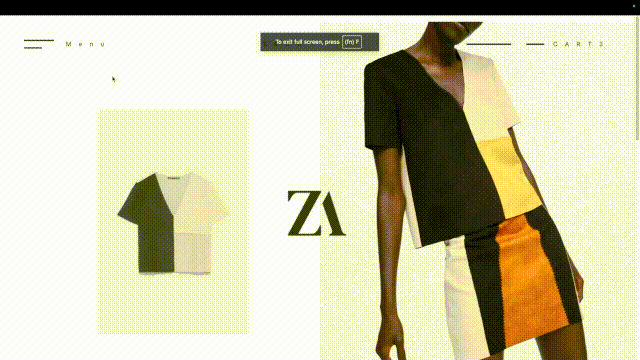

# Zara Redeisgn Front End Only

Meant to represnet a team collaboration home page.
Base of this [Figma Design](https://www.figma.com/design/qZufUM8cVY8Utw58qsllUb/Team-App---SaaS-Landing-Page-Template-(Community)?node-id=81-7076&t=L3NnM5SfZpm3pwoa-1)
(Note I did not create this from starch I very slight altered some text I found this online from a free resource)

## Features
* Mobilbe Responsivity

## Images

### Installing
Simply Go to the [Deployed Website](https://team-front-end-example.vercel.app/) 

## Help
I really like using Nextjs and Tailwind I think that will be my main stack from going forward. I learnt alot more about tailwind especially how powerfull its media queries are, I also picked up a handy trick with nextjs, NEXT Images
## Authors

Contributors names and contact info

[Damion Morgan](https://github.com/BeginnerLevelUP)

## Version History

* 0.1
    * Initial Release

## License

This project has no license 

